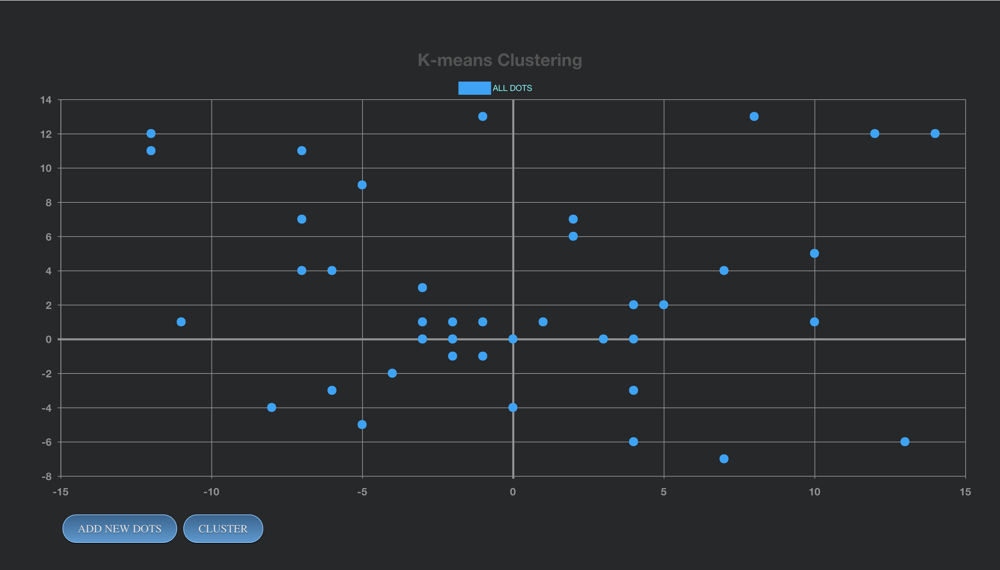
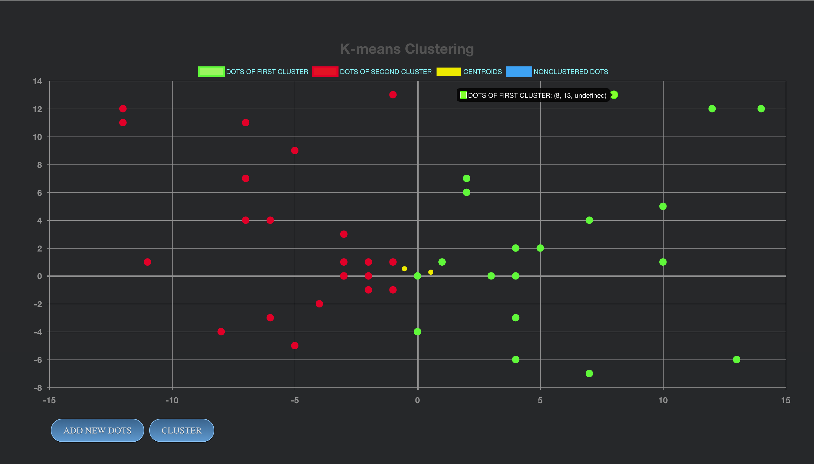

# K-MEANS CLUSTERING

## Web App

This web application is an implementation of the k-means method. Chart.js was used as a tool for creating a chart and its work.
The initial data array is in data.js. All calculations take place in k-means-algorithm.js. The main app.js file is where we loop through the algorithm and change the colors of the dots. main.js - here we connect all our js files.





## Start

```
npm install
bower install
gulp
```

```A. Petrushin. 2016```
